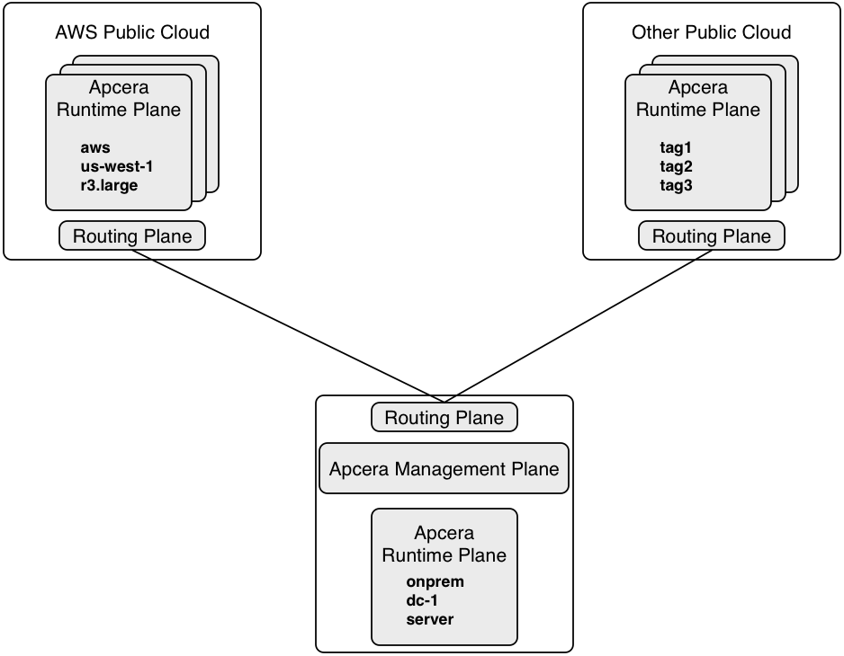
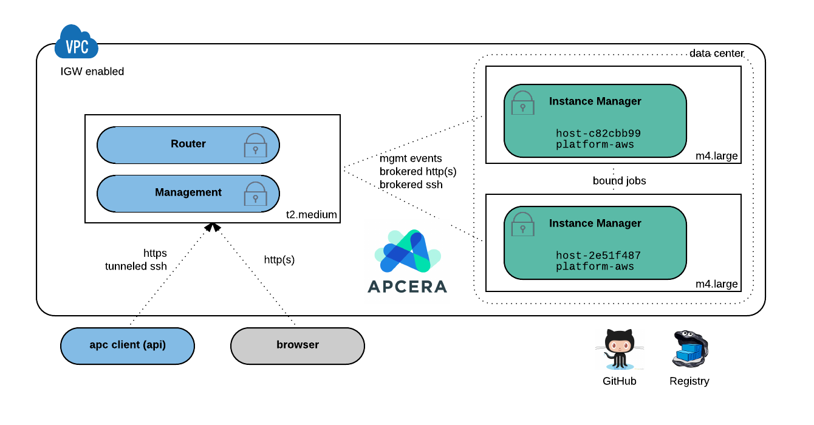

# apc-demo-101

## Client Scenario

Audience is a lead architect responsible for ensuring and improving the pace and cost efficiency of product
developers and the application development cycle at his company.  An overarching concern
is consistent governance and enforcement of mandatory company data
policies and security standards. 

He supports multiple distinct management teams that use multiple languages and frameworks and differ somewhat in their process and skills.  

Today, hosting is done on a mix of manually deployed web and application servers, mostly on-premise (one team is kicking the
tires on AWS EC2). There is little flexibility and re-use in these environments across teams and upgrade cycles are labor-intensive and difficult to manage.

The client is exploring a mix of on-premise and public-cloud hosting (hybrid scenario) but is concerned with the overhead of
maintaining separate operational environments/skillsets and providing secure integration and data connectivity between
 environments. Their has been some experiementation with Docker packaging and a desire to understand how image-centric workflow fits into the
strategic picture.

Most applications use a combination of SQL and NoSQL data sources.  Some are relatively small, others are large, integrated
with many enterprise systems, and hard to move.

The client's desire for this session is a concrete fundamentals demonstration as a follow-up to an introductory meeting
on Apcera Platform architecture and value proposition.

----

### Conceptual Review

[See Apcera Architecture and Components](http://docs.apcera.com/introduction/apcera-arch/)

----

### Demonstration Environment

[See Getting Started with Apcera Community Edition](http://docs.apcera.com/setup/apcera-setup/)

* `apc target https://ace.tinghus.net`
* `apc login --basic; apc namespace`
* `apc cluster im list; apc cluster tag list`

----

### Deploy App from Source

* `git clone git@github.com:tbeets/flasky-grid.git`
* `apc app create flasky-grid; apc app start flasky-grid`
* `apc route add http://flasky-grid.ace.tinghus.net --job flasky-grid`

[GitHub: tbeets/flasky-grid](https://github.com/tbeets/flasky-grid)

----

### Deploy App from Image

* `apc docker run my-store --image tbeets/my-store --routes http://my-store.ace.tinghus.net --port 5000`

[DockerHub: tbeets/my-store](https://hub.docker.com/r/tbeets/my-store/)

----

### Manifest & Create a Database Service

* `git clone git@github.com:tbeets/flasky-apcera-db.git`

*continuum.conf* manifest:

    name: "flasky-apcera-db"
    instances: 1
    start_cmd: "./bin/gunicorn manage:app -c gunicorn.config"
    resources {
      memory: "256MB"
      network_bandwidth: "100Mbps"
    }
    env {
      "FLASK_CONFIG": "heroku",
      "SSL_DISABLE": "True"
    }
    start: true
    services [
      {
        provider_name: "provider::/apcera/providers::postgres-provider",
        type: "postgres",
        service_name: "flasky-db"
      },
      {
        type: "network",
        service_name: "/apcera::outside"
      }

* `apc app create`
* `apc service list`

[GitHub: tbeets/flasky-apcera-db](https://github.com/tbeets/flasky-apcera-db)

----

### App Consoles and Capsules

* `apc app console flasky-apcera-db`
    * `cd /app; ./bin/python manage.py deploy`

* `apc console create my-cap --image linux --allow-egress`
* `apc service bind flaskydb --job my-cap`
* `apc capsule connect my-cap`
    * `sudo apt-get update; sudo apt-get install postgresql postgresql-contrib`
    * (referencing `$POSTGRES_URI`) `psql --host=169.254.171.171 --port=20000 --username=6meuussqxamfohgv -d 5a1f124d272a42bb916dd5fd53ccd84a`
    * `update users set confirmed='t' where id=X;`
    * `\q` to exit psql
    
----

### Scale and Delete an App

* `apc app update my-store --instances 2`
* `apc app update my-store --memory 512MB`
* `apc app delete my-store` 

----

### (Optional) Hard Tag Scheduling Policy

* `apc app create/update ... --hard-tags host-2e51f487`

*customPolicy* policy document:

    job::/sandbox/user2 {
        { schedulingTag.hard host-2e51f487 }
    }

* `apc logout; apc login --basic` (as user2) 
* `apc docker run my-store-2 --image tbeets/my-store --routes http://my-store-2.ace.tinghus.net --port 5000`
* `apc app show my-store-2` (note hard tag)

